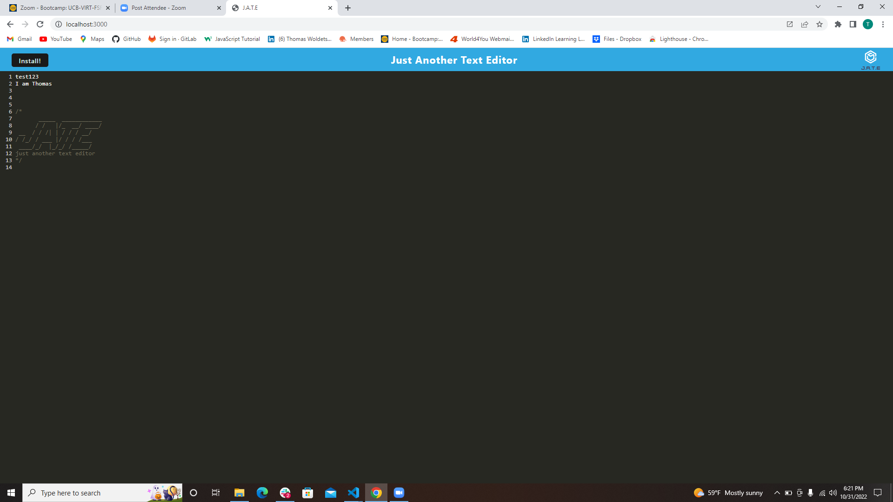
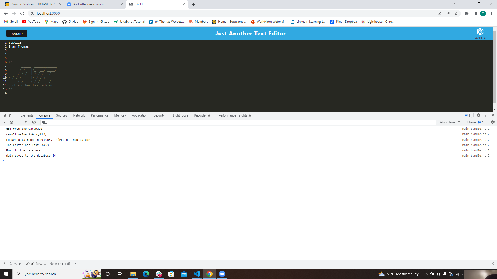
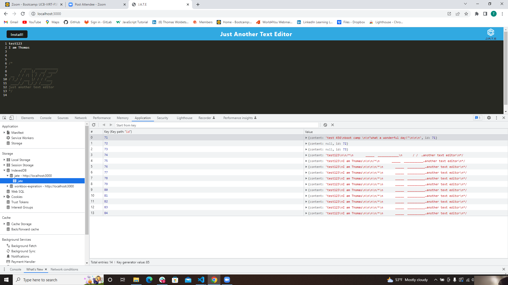
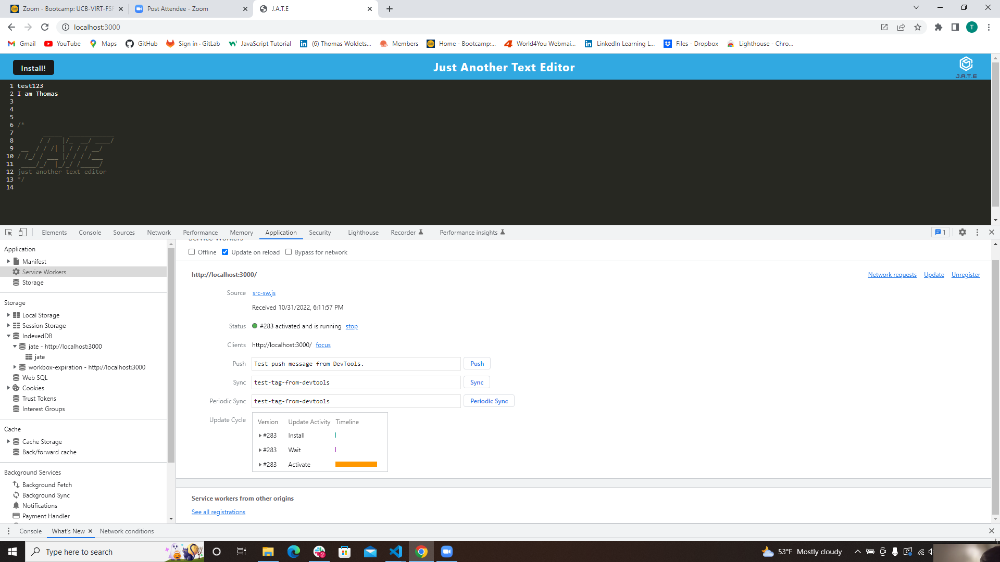
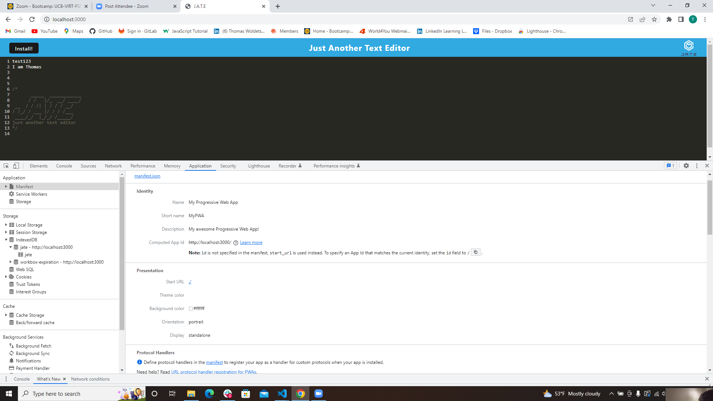

# Progressive Web Applications (PWA): Text Editor

[Heroku Link](https://dreadful-witch-86779.herokuapp.com/)

## Description

This app is a single-page application that meets the PWA criteria. Additionally, it features a number of data persistence techniques
that serve as redundancy in case one of the options is not supported by the browser. The application will also function offline.the
text editor runs in the browser.

I build this text editor, start with an existing application and implement methods for getting and storing data to an IndexedDB database.
I used a package called `idb`, which is a lightweight wrapper around the IndexedDB API. It features a number of methods that are useful
for storing and retrieving data.

heroku-link is attached on this README file.

## Uses

as a developer I created notes or code snippets with or without an internet connectionso that I can reliably retrieve them for later
use.
a text editor web application.when the user opens this application in the editor,then the user should see a client server folder structure.
when the user run `npm run start` from the root directory,then the user find that the application should start up the backend and serve
the client.
when the user run the text editor application from the terminal,then the user finds that the JavaScript files have been bundled using webpack.
when the user run the webpack plugins,then the user finds that a generated HTML file, service worker, and a manifest file,
when the user use next-gen JavaScript in the application,then the user finds that the text editor still functions in the browser without
errors.
when the user opens the text editor,then the user finds that IndexedDB has immediately created a database storage.
when the user enters content and subsequently click off of the DOM window,then the user finds that the content in the text editor has been
saved with IndexedDB.when the user reopens the text editor after closing it,then the user finds that the content in the text editor has been
retrieved from our IndexedDB.when the user click on the Install button,then the user download the web application as an icon on the desktop.
when the user loads the web application,then the user should have a registered service worker using workbox.
when the user registers a service worker,then the user should have a static assets pre cached upon loading along with subsequent pages and
static assets
when the user deploys to Heroku,then the user should have proper build scripts for a webpack application.
